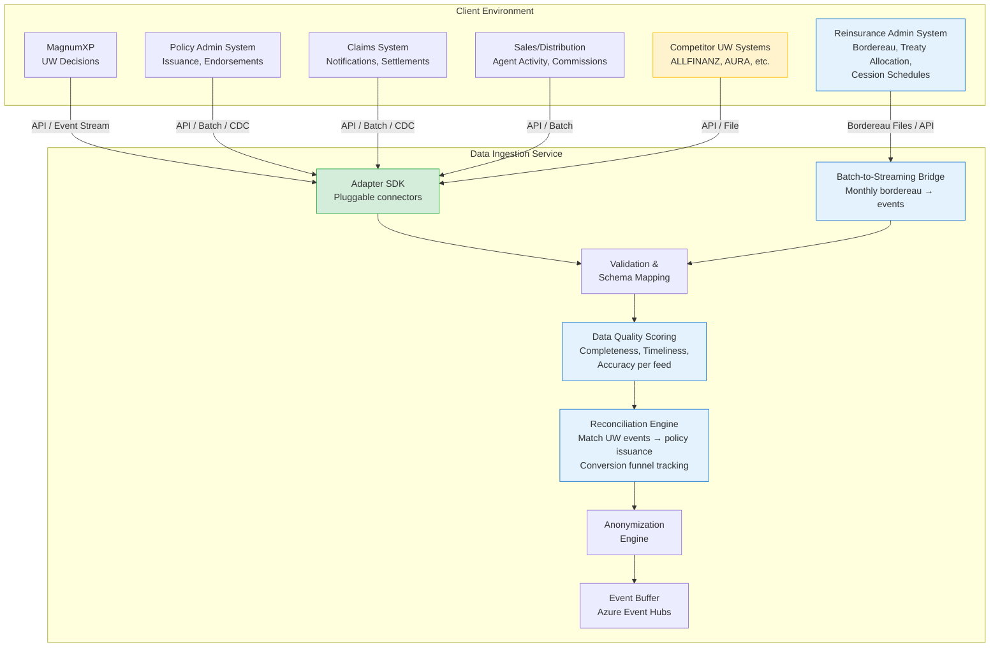
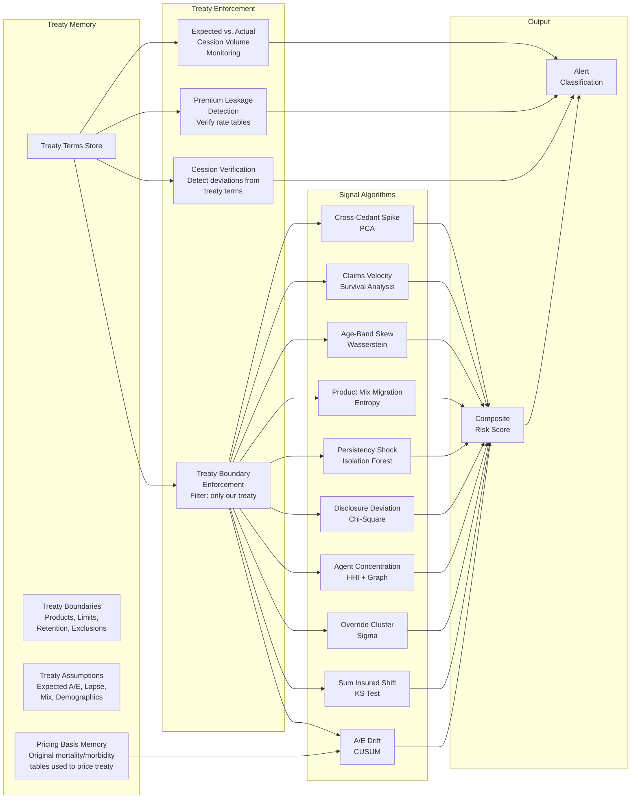
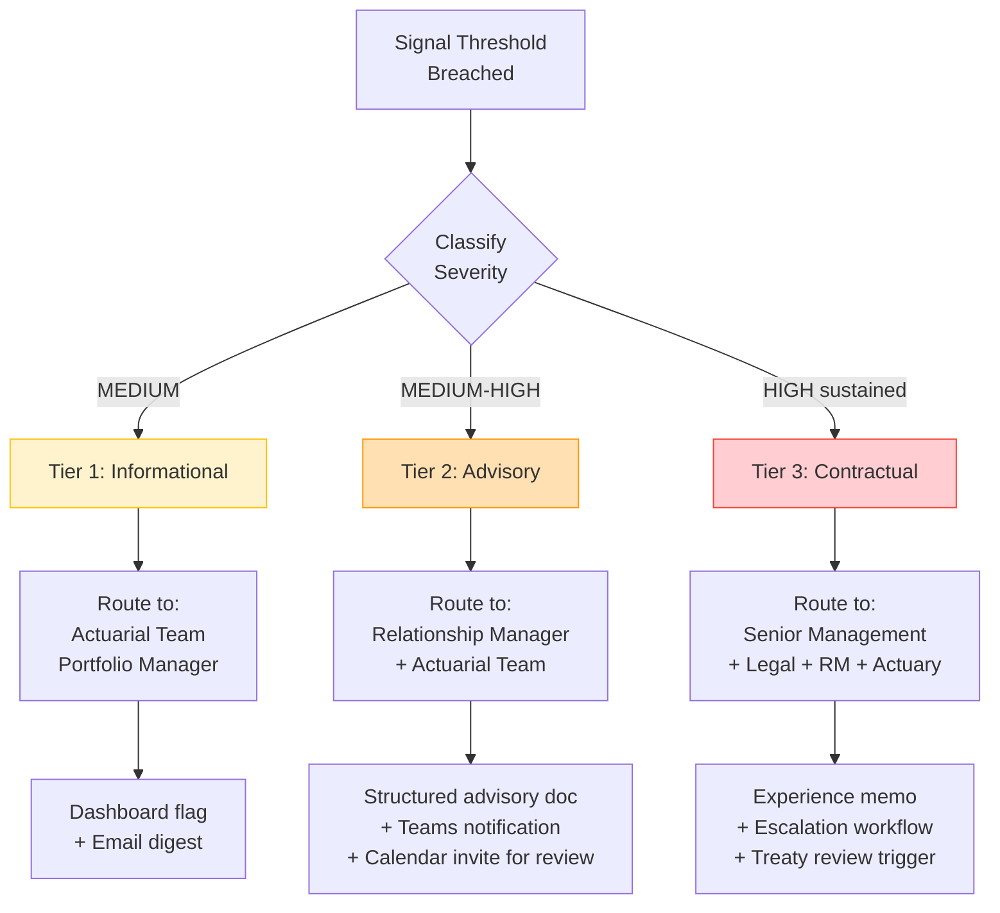
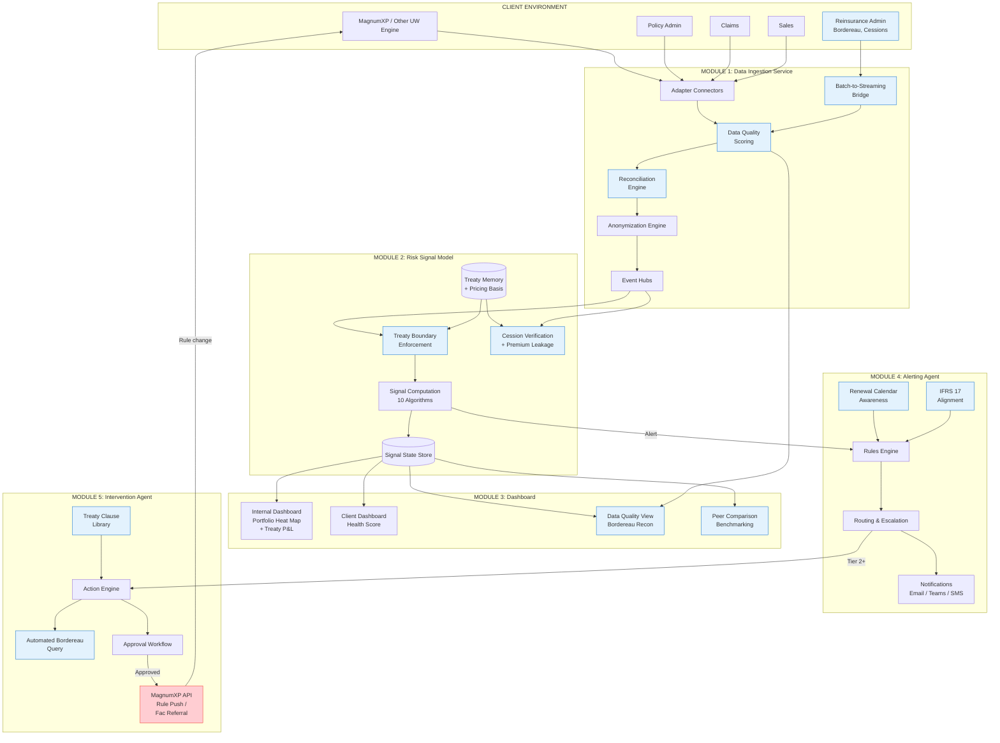
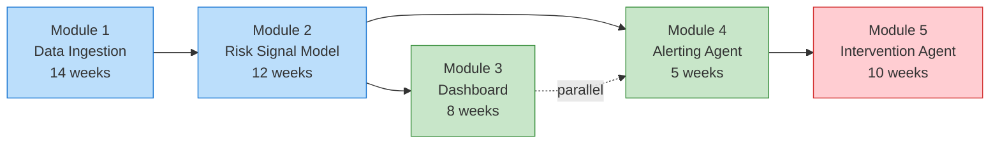

# Live Risk Signal & Intervention Agent
## Capability Build & Prototype Proposal — v2

> **Audience**: Senior Management | **Classification**: Confidential
> **Date**: March 2026 | **Version**: 2.0.0

---

# SLIDE 1 — The Problem We're Solving

## The Reinsurer's Blind Spot

```
         WHAT WE KNOW                          WHAT WE DON'T KNOW
    ┌─────────────────────┐              ┌──────────────────────────────┐
    │  MagnumXP Today     │              │  After MagnumXP Decision     │
    │                     │              │                              │
    │  ✓ UW application   │              │  ✗ Was the policy issued?    │
    │  ✓ Risk assessment  │              │  ✗ Is it on OUR treaty?      │
    │  ✓ UW decision      │              │  ✗ What's the claims status? │
    │  ✓ Medical evidence │              │  ✗ Has it lapsed?            │
    │                     │              │  ✗ Was it altered post-issue? │
    │                     │              │  ✗ Were ceded premiums right? │
    │                     │              │  ✗ Does it match treaty terms?│
    └─────────────────────┘              └──────────────────────────────┘
           POINT OF SALE                      PRIMARY INSURER SYSTEMS
```

**MagnumXP sees the underwriting moment — but the risk story continues long after.**

- A policy assessed by MagnumXP may never be issued
- A policy may be issued but placed on a competitor's treaty, not ours
- Policies may be ceded that fall outside treaty terms — wrong product, wrong retention, wrong age band
- Anti-selection, agent misbehavior, and claims patterns are invisible until quarterly reports arrive — **6 to 18 months too late**

**Result: $4–6M annual excess exposure on a $2B APAC portfolio due to late detection.**

---

# SLIDE 2 — What Exists Today vs. What We Need

## Current State → Target State

```
    ┌─────────────────────────────────────────────────────────────┐
    │                     CURRENT STATE                           │
    │                                                             │
    │   MagnumXP ──→ UW Decision ──→ Power BI Dashboards         │
    │      │                              │                       │
    │      │         (data stops here)    │ (retrospective,       │
    │      │                              │  manual analysis,     │
    │      ▼                              │  quarterly cycle)     │
    │   No visibility into:               │                       │
    │   • Policy issuance                 ▼                       │
    │   • Treaty allocation          Relationship Manager         │
    │   • Cession verification       reviews reports manually     │
    │   • Claims experience                                       │
    │   • Lapse behavior                                          │
    │   • Agent patterns                                          │
    │   • Premium leakage                                         │
    └─────────────────────────────────────────────────────────────┘

                              ▼ ▼ ▼

    ┌─────────────────────────────────────────────────────────────┐
    │                     TARGET STATE                            │
    │                                                             │
    │   Client Systems ──→ Data Ingestion ──→ Risk Signal Model   │
    │   (Policy Admin,      Service             (Treaty-aware,    │
    │    Claims, Sales,       │                 statistical,      │
    │    Reinsurance Admin)   │                 cession-verified)  │
    │        +                │                      │            │
    │   MagnumXP ──────────────┘                      │            │
    │   (or competitor UW)                            ▼            │
    │                                          ┌──────────┐       │
    │                                          │Dashboard │       │
    │                                          │(internal │       │
    │                                          │+ client) │       │
    │                                          └────┬─────┘       │
    │                                               │             │
    │                                          ┌────▼─────┐       │
    │                                          │ Alerting │       │
    │                                          │  Agent   │       │
    │                                          └────┬─────┘       │
    │                                               │             │
    │                                          ┌────▼─────────┐   │
    │                                          │ Intervention │   │
    │                                          │    Agent     │   │
    │                                          └──────────────┘   │
    └─────────────────────────────────────────────────────────────┘
```

---

# SLIDE 3 — Five Modules to Build

## The Capability Gap: What's New

| # | Module | What It Does | Why It's New | Build Complexity |
|:-:|--------|-------------|-------------|:---:|
| 1 | **Real-Time Data Ingestion Service** | Collects policy, claims, sales, and **reinsurance admin** data from client systems. Includes data reconciliation engine, batch-to-streaming bridge, and quality scoring. | Today we only see UW decisions. We need the full policy lifecycle **plus** treaty allocation and cession data. | HIGH |
| 2 | **Risk Signal Model** | Holds treaty terms and **original pricing basis** in memory, runs 10 statistical algorithms, enforces treaty boundaries, and detects **cession verification failures** and **premium leakage**. | No automated deviation detection exists today. Analysis is manual and quarterly. No treaty boundary enforcement. | HIGH |
| 3 | **Risk Signal Dashboard** | Visualizes signals for internal teams AND clients. Adds **treaty P&L view**, **bordereau reconciliation**, and **cedant-vs-peer benchmarking**. | Existing Power BI is retrospective and internal-only. No treaty performance or data quality views. | MEDIUM |
| 4 | **Alerting Agent** | Routes the right signal to the right person at the right time. **Treaty renewal calendar awareness** and **IFRS 17 regulatory alignment**. | Today: someone notices something in a report. No structured alerting. No renewal-cycle sensitivity. | MEDIUM |
| 5 | **Intervention Agent** | Takes action — from soft nudges to hard stops at point of sale. **Treaty clause-aware**, **graduated fac referral**, **automated bordereau queries**. | Completely new. Nothing like this exists in the industry. | HIGH |

---

# SLIDE 4 — Module 1: Real-Time Data Ingestion Service

## Bridging the Data Gap



### Key Design Decisions

| Decision | Rationale |
|----------|-----------|
| **Adapter SDK with pluggable connectors** | Each client has different systems. Standard connectors for common PAS vendors (Sapiens, Majesco, Oracle) cover 80% of cases. |
| **Reinsurance Admin System as a key data source** | This is how we know if a policy is on OUR treaty. Bordereau files, treaty allocation records, and cession schedules are the source of truth for what business we're carrying. |
| **Batch-to-streaming bridge** | Many cedants in APAC still operate on monthly bordereau files, not APIs. The bridge converts batch files into event streams for uniform downstream processing. |
| **Data reconciliation engine** | Matches MagnumXP UW events to policy issuance events — the "conversion funnel." Tells us: of 1,000 UW decisions, how many became policies? How many are on our treaty? |
| **Data quality scoring** | Scores each feed on completeness, timeliness, and accuracy. Surfaces data gaps before they become signal blind spots. |
| **Support non-MagnumXP clients** | Extends TAM significantly. MagnumXP becomes a "best case" (richest data), not a hard dependency. |
| **Change Data Capture (CDC) as fallback** | Not all client systems support real-time APIs. CDC from database logs provides near-real-time without modifying source systems. |
| **Anonymization at the edge** | PII never leaves the client environment in identifiable form. Critical for PDPA compliance and client trust. |

### Data We Need Beyond MagnumXP

| Data Element | Source System | Why We Need It |
|-------------|--------------|----------------|
| Policy issuance status | Policy Admin | Know if UW decision became a live policy |
| **Treaty allocation** | **Reinsurance Admin** | **Know if the policy is on OUR treaty or a competitor's** |
| **Cession schedule** | **Reinsurance Admin** | **Verify ceded amounts, retention, and product match treaty terms** |
| **Bordereau data** | **Reinsurance Admin** | **Monthly/quarterly reconciliation of ceded business** |
| Premium collection status | Billing / Finance | Persistency and lapse signals |
| Claims notifications | Claims System | Claims velocity and A/E ratio signals |
| Claims settlements | Claims System | Actual loss experience |
| Agent production data | Sales / Distribution | Agent concentration and behavior signals |
| Policy alterations | Policy Admin | Post-issue changes that affect risk profile |
| Surrender / lapse events | Policy Admin | Persistency shock detection |

---

# SLIDE 5 — Module 2: Risk Signal Model

## Treaty-Aware Intelligence



### What Makes This Different: Treaty Memory + Enforcement

The Risk Signal Model doesn't just look for statistical anomalies — it knows **what was agreed** and **what was priced**.

| Treaty Term | How It's Used |
|------------|---------------|
| **Ceded products** | **Treaty boundary enforcement**: only monitor policies that fall within our treaty scope |
| **Retention limits** | Flag when ceded amounts approach or breach retention thresholds |
| **Expected A/E basis** | CUSUM baseline calibrated to the **original pricing mortality/morbidity tables**, not market averages |
| **Lapse assumptions** | Persistency signals measured against treaty-specific assumptions |
| **Exclusion clauses** | Detect if excluded risk categories are being ceded |
| **Premium rates** | **Premium leakage detection**: verify ceded premiums match agreed rate tables |
| **Territorial scope** | Only monitor business within treaty geographic boundaries |
| **Age band limits** | **Cession verification**: detect if policies outside agreed age bands are being ceded |
| **Cession volume** | **Expected vs. actual monitoring**: flag if cession volumes deviate significantly from projections |

### New v2 Capabilities: Treaty Enforcement Signals

| Signal | What It Detects | Business Impact |
|--------|----------------|-----------------|
| **Cession verification failure** | Policies ceded to us that deviate from treaty terms — wrong product, wrong retention, wrong age band | Prevents treaty leakage where we carry risk we didn't price for |
| **Premium leakage** | Ceded premiums that don't match agreed rate tables — under-cession of premium relative to risk | Directly recoverable revenue — often 1-3% of ceded premium |
| **Volume deviation** | Cession volumes significantly above or below projection — may indicate adverse selection of what gets ceded to us | Early warning that cedant is cherry-picking what to cede |

**Example**: Treaty says expected A/E = 95%, covers term life ages 20–60, 70% retention with 30% cession. The model flags:
- A/E drifting to 105% (CUSUM calibrated against **original pricing tables**, not generic industry tables) → Signal #1
- Sudden spike in age 55–60 applications → Signal #8
- Agent cluster submitting high-sum cases that exceed retention → Signals #2 + #4
- 15 policies ceded with age 63 — **outside treaty boundary** → Cession verification alert
- Premium on 8 critical illness policies ceded at 92% of agreed rate → Premium leakage alert
- Cession volume 140% of projected for Q1 → Volume deviation alert

---

# SLIDE 6 — Module 3: Risk Signal Dashboard

## Three Views: Internal + Client + Data Quality

### Internal View (Reinsurer Teams)

```
┌─────────────────────────────────────────────────────────────────┐
│  RISK SIGNAL DASHBOARD — Internal                    [Export]   │
├───────────┬─────────────────────────────────────────────────────┤
│           │                                                     │
│ CEDANTS   │  PORTFOLIO HEAT MAP                                 │
│           │  ┌─────┬─────┬─────┬─────┬─────┐                   │
│ ▸ All     │  │     │ A/E │ SI  │ Ovr │Agent│                   │
│ ▸ SG-01 ● │  │SG-01│ 🔴  │ 🟡  │ 🟢  │ 🟡  │                   │
│ ▸ SG-02 ○ │  │SG-02│ 🟢  │ 🟢  │ 🟢  │ 🟢  │                   │
│ ▸ MY-01 ● │  │MY-01│ 🟡  │ 🔴  │ 🟡  │ 🔴  │                   │
│ ▸ TH-01 ○ │  │TH-01│ 🟢  │ 🟢  │ 🟡  │ 🟢  │                   │
│           │  └─────┴─────┴─────┴─────┴─────┘                   │
│ VIEWS     │                                                     │
│           │  TREATY PERFORMANCE: SG-01                           │
│ ▸ Signals │  ┌─────────────────────────────────────────┐        │
│ ▸ Treaty  │  │  Ceded Premium YTD:     $12.4M          │        │
│   P&L     │  │  Incurred Claims YTD:    $7.8M          │        │
│ ▸ Data    │  │  Loss Ratio:            62.9% (exp 65%) │        │
│   Quality │  │  Cession Volume:        108% of plan     │        │
│ ▸ Peer    │  │  Premium Leakage:       $42K detected    │        │
│   Compare │  └─────────────────────────────────────────┘        │
│           │                                                     │
│ ACTIONS   │  SIGNAL DETAIL: SG-01 / A/E Ratio Drift             │
│           │  ┌──────────────────────────────────────┐           │
│ [Tier 1]  │  │  CUSUM Chart                    ▲    │           │
│ [Tier 2]  │  │  ─────────────── threshold ──── │ ── │           │
│ [Tier 3]  │  │           ╱                     │    │           │
│           │  │      ╱╱╱╱                       │    │           │
│           │  │  ╱╱╱╱                           │    │           │
│           │  │╱╱                                     │           │
│           │  └──────────────────────────────────────┘           │
└───────────┴─────────────────────────────────────────────────────┘
```

### Client View (Cedant Portal)

```
┌─────────────────────────────────────────────────────────────────┐
│  PORTFOLIO HEALTH — Cedant SG-01                    [Download]  │
├─────────────────────────────────────────────────────────────────┤
│                                                                 │
│  PORTFOLIO SCORE: 72 / 100                                      │
│  ████████████████████████████░░░░░░░░░░  ← Overall health       │
│                                                                 │
│  KEY METRICS                                                    │
│  ┌──────────────┬──────────────┬──────────────┐                 │
│  │  A/E Ratio   │  Override %  │ Persistency  │                 │
│  │    108%  ▲   │    12%  ─    │   88%  ▼     │                 │
│  │  (target 95%)│ (norm 10-15%)│ (target 92%) │                 │
│  └──────────────┴──────────────┴──────────────┘                 │
│                                                                 │
│  TREND (12 months)                                              │
│  ┌──────────────────────────────────────────────┐               │
│  │ A/E  105│    ╱╲                               │               │
│  │     100│╱╱╱╱  ╲╱╲  ╱╲  ╱╱╱╱                  │               │
│  │      95│─ ─ ─ ─ ─╲╱─ ╲╱─ ─ target ─ ─ ─ ─   │               │
│  │      90│                                      │               │
│  │        └──┬──┬──┬──┬──┬──┬──┬──┬──┬──┬──┬──  │               │
│  │          Apr May Jun Jul Aug Sep Oct Nov Dec   │               │
│  └──────────────────────────────────────────────┘               │
│                                                                 │
│  RECOMMENDATIONS                                                │
│  ⚠ Review underwriting guidelines for term life ages 50-60      │
│  ⚠ Agent cluster detected in [Region] — review top 5 agents    │
│                                                                 │
└─────────────────────────────────────────────────────────────────┘
```

### New v2: Comparative & Data Quality Views

| View | What It Shows | Who Uses It |
|------|-------------|-------------|
| **Treaty Performance** | Treaty P&L, cession volume vs. plan, loss ratio trending, premium leakage totals | Actuaries, Portfolio Managers |
| **Bordereau Reconciliation** | Data quality scores per feed, missing records, schema mismatches, timeliness tracking | Data Operations, Actuaries |
| **Cedant vs. Peer Benchmarking** | This cedant's signal profile vs. anonymized peer group in same market | Relationship Managers, Actuaries |

**Key difference from today**: Client sees a curated, actionable health view — not raw data dumps. Internal teams get treaty-level P&L and data quality visibility. This becomes a **value-added service** that strengthens the relationship.

---

# SLIDE 7 — Module 4: Alerting Agent

## Right Person, Right Time, Right Channel



### Alerting Rules Engine

| Rule | Condition | Action |
|------|----------|--------|
| **Suppression** | Signal < MEDIUM for 4+ consecutive cycles | Suppress from dashboard (reduce noise) |
| **Aggregation** | Multiple signals firing for same cedant | Bundle into single composite alert |
| **Escalation** | Tier 1 unacknowledged for 10 business days | Auto-escalate to Tier 2 |
| **De-escalation** | Signal returns below threshold for 3 cycles | Downgrade tier, log resolution |
| **Correlation** | Same signal fires across 3+ cedants in same market | Flag as systemic (market-level, not cedant-level) |
| **Override** | RM marks alert as "expected" with reason | Suppress for agreed duration, log justification |

### New v2: Context-Aware Alerting

| Capability | Description |
|-----------|-------------|
| **Treaty renewal calendar awareness** | Automatically increases signal sensitivity 3 months before treaty renewal date. A signal that would be Tier 1 in month 6 becomes Tier 2 in the renewal window — because there's less time to act and the stakes are higher (renewal pricing). |
| **IFRS 17 regulatory alignment** | Flags signals that may need to be disclosed in IFRS 17 risk adjustment calculations. When A/E drift or persistency shock crosses regulatory-relevant thresholds, generates a parallel notification to the finance/reporting team — not just the actuarial team. |

---

# SLIDE 8 — Module 5: Intervention Agent

## From Soft Nudges to Hard Stops

```
    INTERVENTION SPECTRUM
    ─────────────────────────────────────────────────────────────→
    SOFT                                                    HARD

    ┌──────────┐  ┌──────────┐  ┌──────────┐  ┌──────────┐  ┌──────────────┐
    │  INFORM  │  │  ADVISE  │  │ RESTRICT │  │ ESCALATE │  │    STOP      │
    │          │  │          │  │          │  │          │  │              │
    │ Dashboard│  │ Recommend│  │ Tighten  │  │ Treaty   │  │ Block at     │
    │ flag +   │  │ specific │  │ UW rules │  │ review   │  │ point of     │
    │ email    │  │ actions  │  │ in Magnum│  │ trigger  │  │ sale for     │
    │          │  │ to RM    │  │ for this │  │ + formal │  │ specific     │
    │          │  │          │  │ cedant   │  │ notice   │  │ risk classes │
    └──────────┘  └──────────┘  └──────────┘  └──────────┘  └──────────────┘
      Tier 1        Tier 2       Tier 2+       Tier 3        Tier 3+
      Auto          Auto         Human OK      Human OK      Exec Approval
```

### Intervention Actions Detail

| Action | Trigger | Approval | Mechanism | Reversibility |
|--------|---------|:--------:|-----------|:---:|
| Dashboard flag | Any signal >= MEDIUM | Automatic | Power BI update | Instant |
| Email digest | Tier 1 alert | Automatic | Azure Logic App | N/A |
| Advisory document | Tier 2 alert | Automatic | Template generation | N/A |
| **Automated bordereau query** | **Signal needs more evidence** | **Automatic** | **Secure portal: request specific data from cedant** | **N/A** |
| UW rule tightening | Sustained Tier 2, Signal #3 | RM + Actuary | MagnumXP API: update rules for cedant | Reversible |
| **Graduated fac referral** | **Sustained Tier 2, Signal #2** | **RM + Actuary** | **MagnumXP API: raise fac referral threshold (not block — just increase scrutiny)** | **Reversible** |
| Treaty review trigger | Tier 3 sustained | Senior Mgmt | Workflow: schedule review, generate memo | N/A |
| Formal notice to cedant | Tier 3 sustained | Legal + Senior Mgmt | Template letter via secure portal | N/A |
| **POS block for risk class** | Tier 3+, extreme | **Exec approval** | **MagnumXP API: decline rule for specific risk class/agent** | **Reversible** |

### New v2: Treaty-Clause-Aware Interventions

| Capability | Description |
|-----------|-------------|
| **Treaty clause library** | Every treaty's clauses are digitized and mapped to intervention permissions. Before recommending an intervention, the agent checks: "Does this treaty allow us to do this?" A treaty with an audit clause permits data requests; one without doesn't. A treaty with a premium adjustment clause permits rate changes; one without requires renegotiation. |
| **Graduated facultative referral** | Instead of binary block/allow, the agent can raise the facultative referral threshold — e.g., from $500K to $250K sum assured. More cases get individually reviewed without stopping business entirely. A proportionate response. |
| **Automated bordereau query** | When a signal needs more evidence (e.g., claims velocity spike but limited claims data), the agent auto-generates a structured data request to the cedant via the secure portal. Includes specific fields needed, time range, and business justification. |

### The "Hard Stop" Capability

This is the most powerful — and most sensitive — intervention:

> **When Signal #3 (Override Cluster) + Signal #4 (Agent Concentration) both sustain at HIGH for 3+ months, with executive approval, the system can push a rule change to MagnumXP that automatically declines or refers applications from the identified risk class or agent cluster.**

This is **not** automatic. It requires:
1. Sustained HIGH signals (statistical evidence)
2. Actuarial confirmation
3. Legal review (**treaty clause library confirms the treaty permits this action**)
4. Executive sign-off
5. Cedant notification (contractual requirement)
6. Time-limited (auto-expires after 90 days, must be renewed)

---

# SLIDE 9 — Target Solution: End-to-End View

## How It All Fits Together



**Blue-highlighted components are new in v2.**

---

# SLIDE 10 — What's New vs. What Exists

## Capability Map

```
    ┌───────────────────────────────────────────────────────────────┐
    │                    EXISTING CAPABILITIES                      │
    │  ┌─────────────────┐  ┌──────────────────┐  ┌────────────┐  │
    │  │   MagnumXP      │  │  Power BI        │  │ Azure      │  │
    │  │   UW Engine      │  │  Retrospective   │  │ Cloud      │  │
    │  │   (deployed at   │  │  Dashboards      │  │ Infra      │  │
    │  │    100+ cedants) │  │  (internal only)  │  │            │  │
    │  └────────┬────────┘  └────────┬─────────┘  └─────┬──────┘  │
    │           │                    │                   │          │
    └───────────┼────────────────────┼───────────────────┼──────────┘
                │                    │                   │
    ┌───────────┼────────────────────┼───────────────────┼──────────┐
    │           ▼                    ▼                   ▼          │
    │                    NEW CAPABILITIES TO BUILD                   │
    │                                                               │
    │  ┌─────────────────────────────────────────────────────────┐  │
    │  │  MODULE 1: Data Ingestion Service              [NEW]    │  │
    │  │  • Connectors to PAS, Claims, Sales systems             │  │
    │  │  • Adapter SDK for non-MagnumXP clients                 │  │
    │  │  • Real-time CDC + anonymization at edge                │  │
    │  │  + Reinsurance Admin System connectors (bordereau)      │  │
    │  │  + Batch-to-streaming bridge (monthly files → events)   │  │
    │  │  + Data reconciliation engine (UW → issuance funnel)    │  │
    │  │  + Data quality scoring per feed                        │  │
    │  └─────────────────────────────────────────────────────────┘  │
    │  ┌─────────────────────────────────────────────────────────┐  │
    │  │  MODULE 2: Risk Signal Model                   [NEW]    │  │
    │  │  • Treaty terms memory store                            │  │
    │  │  • 10 statistical/ML signal algorithms                  │  │
    │  │  • Composite risk scoring                               │  │
    │  │  + Treaty boundary enforcement (filter to our scope)    │  │
    │  │  + Cession verification (detect treaty term deviations) │  │
    │  │  + Premium leakage detection (rate table verification)  │  │
    │  │  + Pricing basis memory (original tables, not averages) │  │
    │  │  + Expected vs. actual cession volume monitoring        │  │
    │  └─────────────────────────────────────────────────────────┘  │
    │  ┌─────────────────────────────────────────────────────────┐  │
    │  │  MODULE 3: Risk Signal Dashboard              [EXTEND]  │  │
    │  │  • Real-time portfolio heat map (extends Power BI)      │  │
    │  │  • Client-facing health portal (NEW)                    │  │
    │  │  • Signal drill-down with explainability                │  │
    │  │  + Treaty P&L performance view                          │  │
    │  │  + Bordereau reconciliation / data quality dashboard    │  │
    │  │  + Cedant vs. peer group benchmarking (anonymized)      │  │
    │  └─────────────────────────────────────────────────────────┘  │
    │  ┌─────────────────────────────────────────────────────────┐  │
    │  │  MODULE 4: Alerting Agent                      [NEW]    │  │
    │  │  • Tiered alert classification                          │  │
    │  │  • Role-based routing                                   │  │
    │  │  • Escalation & suppression rules                       │  │
    │  │  + Treaty renewal calendar awareness                    │  │
    │  │  + IFRS 17 regulatory reporting alignment               │  │
    │  └─────────────────────────────────────────────────────────┘  │
    │  ┌─────────────────────────────────────────────────────────┐  │
    │  │  MODULE 5: Intervention Agent                  [NEW]    │  │
    │  │  • Approval workflows (human-in-the-loop)               │  │
    │  │  • MagnumXP API rule push (UW tightening / POS block)   │  │
    │  │  • Treaty review automation                             │  │
    │  │  + Treaty clause library (know what's permitted)         │  │
    │  │  + Graduated facultative referral (proportionate)        │  │
    │  │  + Automated bordereau query to cedant                   │  │
    │  └─────────────────────────────────────────────────────────┘  │
    │                                                               │
    │  Lines marked with + are new in v2                            │
    └───────────────────────────────────────────────────────────────┘
```

---

# SLIDE 11 — Build Effort & Dependencies

## Module Dependencies & Sequencing



| Module | Build Effort | v1 Effort | Delta | Key Dependency | Risk |
|--------|:---:|:---:|:---:|-------------|:---:|
| 1. Data Ingestion | 14 weeks | 12 weeks | +2 | Client system access + reinsurance admin integration | HIGH |
| 2. Risk Signal Model | 12 weeks | 10 weeks | +2 | Module 1 + treaty data digitization + pricing basis capture | MEDIUM |
| 3. Dashboard | 8 weeks | 6 weeks | +2 | Module 2 + Power BI licensing | LOW |
| 4. Alerting Agent | 5 weeks | 4 weeks | +1 | Module 2 + treaty renewal calendar data | LOW |
| 5. Intervention Agent | 10 weeks | 8 weeks | +2 | Module 4 + MagnumXP API + Legal review + clause digitization | HIGH |

**Total build: ~46 weeks** (with parallelization of Modules 3 & 4) — up from 40 weeks in v1.

**Why +6 weeks**: The enriched capabilities (reinsurance admin integration, treaty enforcement, clause library, IFRS 17 alignment) add real depth but also real work. The ROI is significantly higher — premium leakage detection alone can pay for the delta.

**Biggest risk**: Module 1 depends on client cooperation for system access. Start with the most willing cedant. The batch-to-streaming bridge de-risks the "cedant doesn't have APIs" scenario.

---

# SLIDE 12 — Prototype Proposal

## What We Can Build Now: A Clickable Demo

### Purpose

A **browser-based interactive prototype** that senior management can click through to understand:
1. **How primary underwriting works** — the "before" that gives context to the "after"
2. What the system looks like in operation
3. How signals are detected and visualized
4. How the intervention workflow escalates
5. The value proposition for cedant conversations

### What the Prototype IS and IS NOT

| The Prototype IS | The Prototype IS NOT |
|:------|:------|
| A realistic, clickable web application | A production system |
| Populated with synthetic but realistic data | Connected to real client data |
| Demonstrating all 5 modules end-to-end | Running real statistical algorithms |
| **Starts with the UW simulation to show context** | A training tool for MagnumXP |
| Usable in client pitch meetings | Deployed to any client environment |
| Built in 3–4 weeks | A multi-month engineering effort |

### Prototype Scope: 14 Screens

```
    PROTOTYPE FLOW
    ──────────────

    ┌─────────────────────────────────────────────────────────────────┐
    │  UW SIMULATION (The "Before" — Context Setting)                │
    │                                                                 │
    │  [1. UW Application Intake]                                     │
    │       │                                                         │
    │       └──→ [2. MagnumXP Assessment]                             │
    │                 │                                                │
    │                 └──→ [3. Decision & Data Flow]                   │
    │                           │                                      │
    │                           │  "Here's the gap — what happens      │
    │                           │   after this point is invisible      │
    │                           │   to the reinsurer today"            │
    └───────────────────────────┼──────────────────────────────────────┘
                                │
                                ▼
    ┌─────────────────────────────────────────────────────────────────┐
    │  RISK SIGNAL SYSTEM (The "After" — Our Solution)               │
    │                                                                 │
    │  [4. Login & Role Selection]                                    │
    │       │                                                         │
    │       ├──→ [5. Portfolio Overview]  ← Heat map, all cedants     │
    │       │         │                                                │
    │       │         ├──→ [6. Cedant Deep Dive]  ← Treaty P&L +     │
    │       │         │         │                    signals           │
    │       │         │         ├──→ [7. Signal Detail]               │
    │       │         │         │                                      │
    │       │         │         └──→ [8. Treaty Context]              │
    │       │         │                                                │
    │       │         └──→ [9. Alert Queue]                           │
    │       │                   │                                      │
    │       │                   └──→ [10. Intervention Workflow]       │
    │       │                                                          │
    │       ├──→ [11. Client Health Portal]  ← What cedant sees       │
    │       │                                                          │
    │       ├──→ [12. Data Ingestion Monitor]  ← Feeds & quality      │
    │       │                                                          │
    │       ├──→ [13. Comparative Analytics]  ← Peer benchmarking     │
    │       │                                                          │
    │       └──→ [14. POS Block Demo]  ← The "hard stop"              │
    └─────────────────────────────────────────────────────────────────┘
```

### Screen-by-Screen Detail

---

#### Screen 1: UW Application Intake (NEW — UW Simulation)

**Purpose**: Show the audience how a primary insurance application enters the system.

```
┌─────────────────────────────────────────────────────────────────────┐
│  MAGNUMXP — New Application                            SG-Beta     │
├─────────────────────────────────────────────────────────────────────┤
│                                                                     │
│  AGENT: Tan Wei Lin (ID: AGT-4821)          Agency: Premier Life    │
│  ─────────────────────────────────────────────────────────────────  │
│                                                                     │
│  APPLICANT DETAILS                                                  │
│  ┌────────────────────────────────────────────────────────────────┐ │
│  │  Name:           [Lim Kah Seng        ]                        │ │
│  │  Age:            [57                  ]   Gender: [Male ▼]     │ │
│  │  Occupation:     [Business Owner      ]                        │ │
│  │  Smoker Status:  [Non-smoker ▼]                                │ │
│  └────────────────────────────────────────────────────────────────┘ │
│                                                                     │
│  PRODUCT DETAILS                                                    │
│  ┌────────────────────────────────────────────────────────────────┐ │
│  │  Product:        [Term Life 20        ▼]                       │ │
│  │  Sum Assured:    [SGD 2,500,000       ]                        │ │
│  │  Term:           [20 years            ]                        │ │
│  │  Premium:        [SGD 8,420 / year    ]                        │ │
│  └────────────────────────────────────────────────────────────────┘ │
│                                                                     │
│  MEDICAL HISTORY                                                    │
│  ┌────────────────────────────────────────────────────────────────┐ │
│  │  ☐ Heart disease    ☐ Cancer    ☐ Diabetes    ☐ Hypertension   │ │
│  │  ☐ Mental health    ☐ Stroke    ☑ Family Hx: Father (MI, 62)  │ │
│  │                                                                 │ │
│  │  BMI: 27.3          Blood Pressure: 138/88                     │ │
│  │  Lab Results:  [Attached ✓]   ECG: [Attached ✓]               │ │
│  └────────────────────────────────────────────────────────────────┘ │
│                                                                     │
│                              [Submit to MagnumXP Assessment →]      │
│                                                                     │
└─────────────────────────────────────────────────────────────────────┘
```

**Key demo moment**: "This is what a typical agent submission looks like. Note the age (57), high sum assured ($2.5M), and family history of heart disease. This is the kind of application our system needs to watch."

---

#### Screen 2: MagnumXP Assessment (NEW — UW Simulation)

**Purpose**: Show MagnumXP processing the application — rules firing, risk factors, decision.

```
┌─────────────────────────────────────────────────────────────────────┐
│  MAGNUMXP — Assessment Result                          SG-Beta     │
├─────────────────────────────────────────────────────────────────────┤
│                                                                     │
│  APPLICATION: APP-2026-03847          STATUS: ⚠ REFER TO UW        │
│  ─────────────────────────────────────────────────────────────────  │
│                                                                     │
│  RULES FIRED                                                        │
│  ┌──┬───────────────────────────────────┬──────────┬───────────┐   │
│  │# │ Rule                              │ Result   │ Impact    │   │
│  ├──┼───────────────────────────────────┼──────────┼───────────┤   │
│  │1 │ Age > 55 + Sum Assured > $1M      │ REFER    │ High SA   │   │
│  │2 │ BMI 27.3 (overweight range)       │ +25 pts  │ Loading   │   │
│  │3 │ BP 138/88 (Stage 1 hypertension)  │ +50 pts  │ Loading   │   │
│  │4 │ Family Hx: MI father age 62       │ +25 pts  │ Loading   │   │
│  │5 │ Occupation: Business Owner        │ PASS     │ Standard  │   │
│  │6 │ Non-smoker                        │ -10 pts  │ Credit    │   │
│  └──┴───────────────────────────────────┴──────────┴───────────┘   │
│                                                                     │
│  RISK SCORE: 185 / 300    ████████████████████░░░░░░░░░░           │
│                                                                     │
│  ┌───────────────────────────────────────────────────────────────┐  │
│  │  RECOMMENDATION          │  DECISION OPTIONS                  │  │
│  │                          │                                    │  │
│  │  Auto-decision: REFER    │  ○ Accept at standard rate         │  │
│  │                          │  ● Accept with loading (+75%)      │  │
│  │  Reason: High sum        │  ○ Decline                         │  │
│  │  assured + age + medical │  ○ Postpone pending further tests  │  │
│  │  risk factors exceed     │                                    │  │
│  │  auto-accept threshold   │  Underwriter: [Dr. Sarah Chen  ▼] │  │
│  │                          │                                    │  │
│  │                          │  [Override: Accept Standard ▼]     │  │
│  └───────────────────────────────────────────────────────────────┘  │
│                                                                     │
│  ⚠ NOTE: If underwriter overrides to "Accept Standard", this       │
│    creates an override event — exactly what Signal #3 detects.     │
│                                                                     │
│                              [Submit Decision →]                    │
│                                                                     │
└─────────────────────────────────────────────────────────────────────┘
```

**Key demo moment**: "MagnumXP recommends REFER with a +75% loading. But watch — the underwriter can override this to Accept Standard. That override is invisible to us today. Our system will detect patterns of overrides like this."

---

#### Screen 3: Decision & Data Flow (NEW — UW Simulation)

**Purpose**: Show what happens after the UW decision — and where the reinsurer's visibility ends.

```
┌─────────────────────────────────────────────────────────────────────┐
│  WHAT HAPPENS NEXT — The Data Gap                                   │
├─────────────────────────────────────────────────────────────────────┤
│                                                                     │
│  UW DECISION: Accept with +75% loading                              │
│  ─────────────────────────────────────────────────────────────────  │
│                                                                     │
│  ┌─────────────┐     ┌──────────────┐     ┌───────────────────┐    │
│  │ MagnumXP    │────→│ Policy Admin │────→│ Reinsurance Admin │    │
│  │ Decision    │     │ System       │     │ System            │    │
│  │             │     │              │     │                   │    │
│  │ Accept +75% │     │ Issue policy │     │ Allocate to       │    │
│  │ loading     │     │ POL-2026-    │     │ Treaty QS-SG-01   │    │
│  │             │     │ 18294        │     │ Cede 30%          │    │
│  └──────┬──────┘     └──────┬───────┘     └────────┬──────────┘    │
│         │                   │                      │               │
│    WE SEE THIS         WE DON'T              WE DON'T             │
│    ✓ Today             SEE THIS              SEE THIS             │
│                        ✗ Today               ✗ Today              │
│                                                                     │
│  ─────────────────────────────────────────────────────────────────  │
│                                                                     │
│  WHAT WE'RE MISSING (and what our system captures):                 │
│                                                                     │
│  ┌─────────────────────┬───────────────────┬────────────────────┐  │
│  │ Event               │ Today             │ With Our System    │  │
│  ├─────────────────────┼───────────────────┼────────────────────┤  │
│  │ Policy issued?      │ Unknown for       │ Confirmed within   │  │
│  │                     │ 3-6 months        │ 24 hours           │  │
│  │ On OUR treaty?      │ Unknown until     │ Confirmed at       │  │
│  │                     │ bordereau arrives  │ allocation         │  │
│  │ Correct cession?    │ Never checked     │ Auto-verified      │  │
│  │                     │ systematically    │ against treaty     │  │
│  │ Premium correct?    │ Checked annually  │ Verified per       │  │
│  │                     │ in audit          │ policy at cession  │  │
│  │ Override was made?  │ Not tracked       │ Signal #3 fires    │  │
│  │ Agent pattern?      │ Not tracked       │ Signal #4 fires    │  │
│  │ Claims experience?  │ 6-18 month lag    │ Real-time feed     │  │
│  └─────────────────────┴───────────────────┴────────────────────┘  │
│                                                                     │
│  ⚠ THE GAP: Between MagnumXP decision and our next visibility      │
│    (quarterly bordereau), the primary insurer can:                  │
│    • Issue the policy without the loading (override)                │
│    • Allocate it to a different treaty                              │
│    • Under-cede the premium                                         │
│    • And we wouldn't know for months.                               │
│                                                                     │
│                    [Enter the Risk Signal System →]                  │
│                                                                     │
└─────────────────────────────────────────────────────────────────────┘
```

**Key demo moment**: "This is the gap. Between the MagnumXP decision and our next visibility point, the primary insurer makes dozens of decisions we can't see. Our system closes this gap."

---

#### Screen 4: Login & Role Selection

- Toggle between roles: **Actuary**, **Relationship Manager**, **Senior Management**, **Client (Cedant)**
- Each role sees a different view — demonstrates role-based access

---

#### Screen 5: Portfolio Overview (Enhanced)

```
┌─────────────────────────────────────────────────────────────────────┐
│  PORTFOLIO OVERVIEW — APAC                    Actuary View [▼]     │
├─────────────────────────────────────────────────────────────────────┤
│                                                                     │
│  PORTFOLIO SUMMARY                                                  │
│  ┌──────────────┬──────────────┬──────────────┬──────────────┐     │
│  │  Total Ceded  │ Active       │  Portfolio   │  Data Quality│     │
│  │  Premium YTD  │ Signals      │  Risk Score  │  Score       │     │
│  │  $142.8M      │  14 ⚠  3 🔴 │  71 / 100    │  87%         │     │
│  └──────────────┴──────────────┴──────────────┴──────────────┘     │
│                                                                     │
│  HEAT MAP: Cedants × Signals                                        │
│  ┌──────────┬─────┬─────┬─────┬─────┬─────┬─────┬──────┬───────┐  │
│  │ Cedant   │ A/E │ SI  │ Ovr │Agent│Disc │Lapse│Score │Treaty │  │
│  │          │     │     │     │     │     │     │      │P&L    │  │
│  ├──────────┼─────┼─────┼─────┼─────┼─────┼─────┼──────┼───────┤  │
│  │SG-Alpha  │ 🟢  │ 🟢  │ 🟢  │ 🟢  │ 🟢  │ 🟢  │ 92   │ +$1.2M│  │
│  │SG-Beta ● │ 🔴  │ 🟡  │ 🔴  │ 🔴  │ 🟢  │ 🟡  │ 58   │ -$340K│  │
│  │MY-Gamma  │ 🟡  │ 🔴  │ 🟡  │ 🔴  │ 🟡  │ 🟢  │ 64   │ -$180K│  │
│  │MY-Delta  │ 🟢  │ 🟢  │ 🟡  │ 🟡  │ 🔴  │ 🟢  │ 73   │ +$420K│  │
│  │TH-Epsilon│ 🟢  │ 🟢  │ 🟢  │ 🟢  │ 🟢  │ 🟡  │ 85   │ +$890K│  │
│  │TH-Zeta   │ 🟢  │ 🟡  │ 🟢  │ 🟢  │ 🟢  │ 🔴  │ 69   │ -$95K │  │
│  └──────────┴─────┴─────┴─────┴─────┴─────┴─────┴──────┴───────┘  │
│                                                                     │
│  ● = Active Tier 2+ alerts      Click any cell to drill down       │
│                                                                     │
└─────────────────────────────────────────────────────────────────────┘
```

**Key demo moment**: "Here's our APAC portfolio at a glance. Six cedants, signal heat map, composite score, and — new in v2 — treaty P&L per cedant. SG-Beta has three red signals and is $340K underwater. Let's investigate."

---

#### Screen 6: Cedant Deep Dive (Enhanced with Treaty Performance)

```
┌─────────────────────────────────────────────────────────────────────┐
│  CEDANT DEEP DIVE — SG-Beta                         [Back to Map]  │
├──────────────────────┬──────────────────────────────────────────────┤
│                      │                                              │
│  TREATY INFO         │  TREATY PERFORMANCE                          │
│  ────────────        │  ┌────────────────────────────────────────┐  │
│  Treaty: QS-SG-02    │  │  Ceded Premium YTD:  $18.6M            │  │
│  Type: Quota Share    │  │  Incurred Claims:    $12.7M            │  │
│  Cession: 30%        │  │  Loss Ratio:         68.3% (exp 62%)   │  │
│  Retention: 70%      │  │  Cession Volume:     127% of plan      │  │
│  Products: Term,     │  │  Premium Leakage:    $86K detected     │  │
│   Whole Life, CI     │  │                                        │  │
│  Ages: 18-60         │  │  ⚠ Loss ratio 6.3pts above expected    │  │
│  Renewal: Jul 2026   │  │  ⚠ Cession volume 27% above plan      │  │
│  ────────────        │  └────────────────────────────────────────┘  │
│                      │                                              │
│  RISK SCORE          │  SIGNAL TRENDS (12 months)                   │
│  ┌───────────────┐   │  ┌────────────────────────────────────────┐  │
│  │     58/100    │   │  │ A/E ──── 108% ↑  (threshold: 100%)    │  │
│  │   ▼ from 85   │   │  │ SI  ──── KS 0.12 (threshold: 0.08)    │  │
│  │   8 weeks ago │   │  │ Ovr ──── 24% ↑↑  (baseline: 12%)     │  │
│  └───────────────┘   │  │ Agt ──── HHI 0.31 (baseline: 0.15)    │  │
│                      │  └────────────────────────────────────────┘  │
│  ACTIVE ALERTS       │                                              │
│  ┌───────────────┐   │  CESSION VERIFICATION                       │
│  │ 🔴 A/E Drift  │   │  ┌────────────────────────────────────────┐  │
│  │    Tier 2     │   │  │  8 policies ceded outside age band     │  │
│  │ 🔴 Override   │   │  │  3 policies: incorrect retention split │  │
│  │    Tier 2     │   │  │  Premium shortfall: $86K               │  │
│  │ 🔴 Agent HHI  │   │  └────────────────────────────────────────┘  │
│  │    Tier 1     │   │                                              │
│  └───────────────┘   │                                              │
│                      │                                              │
└──────────────────────┴──────────────────────────────────────────────┘
```

**Key demo moment**: "SG-Beta's composite score dropped from 85 to 58 in 8 weeks. The A/E ratio is drifting, overrides are clustering, and agent concentration is spiking. Plus — new — we can see the treaty is $340K underwater with 8 out-of-boundary cessions and $86K in premium leakage."

---

#### Screen 7: Signal Detail

- Full signal visualization (e.g., CUSUM accumulation chart with threshold line)
- Statistical detail panel (current value, threshold, p-value, confidence)
- "What does this mean?" explainer panel in plain English
- Contributing factors breakdown
- Historical comparison (same signal, same cedant, prior year)
- **Key demo moment**: "Here's exactly what the actuary sees. The CUSUM chart shows the drift accumulating — this isn't noise, it's a sustained shift."

---

#### Screen 8: Treaty Context

- Side-by-side: **Treaty Terms** vs. **Actual Experience**
- Expected A/E vs. actual A/E (with confidence bands, calibrated to **original pricing basis**)
- Product mix: agreed vs. actual distribution
- Sum insured bands: expected vs. actual
- Financial impact estimate: "At current drift rate, excess exposure is $X over Y months"
- **Key demo moment**: "The treaty was priced assuming A/E of 95% based on the 2023 mortality tables. We're at 108% and climbing. That's $1.2M excess exposure over 12 months."

---

#### Screen 9: Alert Queue

- Inbox-style list of all active alerts
- Filterable by: tier, cedant, signal type, date
- Each alert shows: signal name, severity badge, days active, assigned to
- **Treaty renewal proximity badge** — alerts near renewal dates are flagged with a countdown
- Quick actions: Acknowledge, Escalate, Mark as Expected, View Detail
- **Key demo moment**: "The alerting agent has routed this to the right person. Notice SG-Beta's alerts are flagged 'RENEWAL IN 4 MONTHS' — sensitivity is automatically elevated."

---

#### Screen 10: Intervention Workflow

- Step-by-step approval flow for Tier 2/3 interventions
- **Treaty clause check** — shows which treaty clauses authorize the proposed action
- Shows who needs to approve and current status
- Draft advisory document preview (for Tier 2)
- Draft experience memo preview (for Tier 3)
- Action buttons: Approve, Request Changes, Reject
- Audit trail of all decisions
- **Key demo moment**: "One click to escalate. The system already checked — clause 14.2 of this treaty permits us to request an underwriting audit. The advisory document is pre-drafted with signal evidence."

---

#### Screen 11: Client Health Portal (NEW — Dedicated Screen)

```
┌─────────────────────────────────────────────────────────────────────┐
│  PORTFOLIO HEALTH — SG-Beta                  [Download Report]     │
├─────────────────────────────────────────────────────────────────────┤
│                                                                     │
│  Welcome, Ms. Tan (Head of Underwriting, SG-Beta)                   │
│                                                                     │
│  OVERALL HEALTH SCORE: 72 / 100                                     │
│  ████████████████████████████░░░░░░░░░░                             │
│                                                                     │
│  YOUR METRICS vs. PEER GROUP (anonymized)                           │
│  ┌──────────────┬───────────┬────────────┬────────────┐            │
│  │ Metric       │ You       │ Peer Avg   │ Trend      │            │
│  ├──────────────┼───────────┼────────────┼────────────┤            │
│  │ A/E Ratio    │ 108%      │ 97%        │ ▲ worsening│            │
│  │ Override %   │ 24%       │ 11%        │ ▲ worsening│            │
│  │ Persistency  │ 88%       │ 91%        │ ▼ declining│            │
│  │ Data Quality │ 82%       │ 89%        │ ─ stable   │            │
│  └──────────────┴───────────┴────────────┴────────────┘            │
│                                                                     │
│  RECOMMENDED ACTIONS                                                │
│  ┌─────────────────────────────────────────────────────────────┐   │
│  │ 1. Review UW override policy for term life ages 50-60       │   │
│  │    Your override rate for this segment is 2.2x peer average │   │
│  │                                                              │   │
│  │ 2. Agent performance review: top 5 agents by concentration  │   │
│  │    Agent cluster detected in Central region                  │   │
│  │                                                              │   │
│  │ 3. Submit updated bordereau for Q4 2025                      │   │
│  │    Data completeness gap identified — 12% of records missing │   │
│  └─────────────────────────────────────────────────────────────┘   │
│                                                                     │
│  This portal is a value-added service from your reinsurance partner │
│                                                                     │
└─────────────────────────────────────────────────────────────────────┘
```

**Key demo moment**: "This is what the cedant sees. Not our internal signals — a curated health view that positions us as a value-added partner. Notice the peer comparison: they can see they're at 2.2x the peer average for overrides. That's a conversation starter."

---

#### Screen 12: Data Ingestion Monitor (NEW)

```
┌─────────────────────────────────────────────────────────────────────┐
│  DATA INGESTION MONITOR                         [Refresh] [Export]  │
├─────────────────────────────────────────────────────────────────────┤
│                                                                     │
│  FEED STATUS                                                        │
│  ┌────────────────┬──────────┬────────────┬──────────┬───────────┐ │
│  │ Feed           │ Source   │ Last Recv  │ Quality  │ Status    │ │
│  ├────────────────┼──────────┼────────────┼──────────┼───────────┤ │
│  │ MagnumXP UW    │ API      │ 2 min ago  │ 98%      │ 🟢 Live   │ │
│  │ Policy Admin   │ CDC      │ 15 min ago │ 94%      │ 🟢 Live   │ │
│  │ Claims         │ API      │ 1 hr ago   │ 91%      │ 🟢 Live   │ │
│  │ Sales/Agent    │ Batch    │ Yesterday  │ 87%      │ 🟡 Delay  │ │
│  │ Bordereau      │ File     │ 12 Mar     │ 82%      │ 🟡 Monthly│ │
│  │ Reins Admin    │ Batch    │ 10 Mar     │ 76%      │ 🔴 Stale  │ │
│  └────────────────┴──────────┴────────────┴──────────┴───────────┘ │
│                                                                     │
│  RECONCILIATION: UW Decision → Policy Issuance                     │
│  ┌───────────────────────────────────────────────────────┐         │
│  │  UW Decisions (Mar):    412                            │         │
│  │  Policies Issued:       387  (93.9% conversion)        │         │
│  │  On Our Treaty:         118  (30.5% — expected 30%)    │         │
│  │  Unmatched:              25  (6.1% — investigate)      │         │
│  │  ████████████████████████████████████░░░  93.9%         │         │
│  └───────────────────────────────────────────────────────┘         │
│                                                                     │
│  DATA QUALITY BREAKDOWN                                             │
│  ┌──────────────────────────────────────────────────────┐          │
│  │  Completeness:  87%  ██████████████████████░░░░░     │          │
│  │  Timeliness:    79%  ████████████████████░░░░░░░     │          │
│  │  Accuracy:      94%  ████████████████████████████░░  │          │
│  │                                                      │          │
│  │  ⚠ 12% of bordereau records missing agent ID field  │          │
│  │  ⚠ Reins Admin feed 6 days stale — auto-query sent  │          │
│  └──────────────────────────────────────────────────────┘          │
│                                                                     │
└─────────────────────────────────────────────────────────────────────┘
```

**Key demo moment**: "This is Module 1 in action. We can see every data feed, its quality score, and the reconciliation funnel. 412 UW decisions became 387 policies, 118 on our treaty. The 25 unmatched records? That's what we investigate."

---

#### Screen 13: Comparative Analytics (NEW)

```
┌─────────────────────────────────────────────────────────────────────┐
│  COMPARATIVE ANALYTICS — SG-Beta vs. Peer Group      [Export PDF]  │
├─────────────────────────────────────────────────────────────────────┤
│                                                                     │
│  PEER GROUP: Singapore Life Insurers (n=4, anonymized)              │
│                                                                     │
│  SIGNAL COMPARISON                                                  │
│  ┌─────────────────────────────────────────────────────────────┐   │
│  │             SG-Beta          Peer Range        Peer Avg     │   │
│  │  A/E Ratio    108% ●────────[92%──97%]──────── 96%         │   │
│  │  Override %    24% ●────────[8%───14%]──────── 11%         │   │
│  │  Persistency   88% ────────[88%──94%]●──────── 91%         │   │
│  │  Agent HHI    0.31 ●────────[0.08─0.18]─────── 0.14        │   │
│  │  Disclosure    OK  ────────[OK───OK]●───────── OK          │   │
│  │  Claims Vel    OK  ────────[OK───OK]●───────── OK          │   │
│  └─────────────────────────────────────────────────────────────┘   │
│  ● = SG-Beta position    [  ] = Peer range                         │
│                                                                     │
│  KEY OUTLIER ANALYSIS                                               │
│  ┌─────────────────────────────────────────────────────────────┐   │
│  │  SG-Beta is a significant outlier on 3 of 10 signals:      │   │
│  │                                                              │   │
│  │  • A/E Ratio: 12pts above peer avg (3.1σ from peer mean)   │   │
│  │  • Override %: 13pts above peer avg (2.8σ from peer mean)  │   │
│  │  • Agent HHI: 2.2x peer avg (2.4σ from peer mean)         │   │
│  │                                                              │   │
│  │  This pattern (A/E + Override + Agent together) has been    │   │
│  │  associated with anti-selection in 4 of 5 historical cases │   │
│  └─────────────────────────────────────────────────────────────┘   │
│                                                                     │
└─────────────────────────────────────────────────────────────────────┘
```

**Key demo moment**: "Here's the comparative view. SG-Beta is a significant outlier on 3 signals — and that pattern (A/E + Override + Agent clustering together) has historically been associated with anti-selection. This isn't just one metric being off — it's a pattern."

---

#### Screen 14: POS Block Demo (The Showstopper)

- Demonstrates the "hard stop" intervention
- Shows the MagnumXP rule that would be pushed
- Before/after: what happens when an agent submits an application in the blocked risk class
- **Treaty clause verification** — shows which clause authorizes the block
- Approval chain visualization (Actuary → Legal → Executive)
- Auto-expiry countdown and renewal mechanism
- **Key demo moment**: "This is the nuclear option. With exec approval, and after verifying clause 18.3 permits it, we can push a rule change to MagnumXP that blocks specific risk classes at point of sale. No other reinsurer can do this."

---

### Prototype Technology

| Component | Technology | Why |
|-----------|-----------|-----|
| Frontend | React + TypeScript + Tailwind CSS | Fast development, polished UI |
| Charts | Recharts or D3.js | Statistical visualizations (CUSUM, KS, survival curves) |
| Data | Static JSON fixtures | Synthetic but realistic data, no backend needed |
| Routing | React Router | Multi-screen navigation |
| Hosting | GitHub Pages or Vercel | Instant deployment, shareable URL |
| Build time | **3–4 weeks** | One developer, full-time |

### Synthetic Data Design

The prototype uses carefully crafted synthetic data for **6 fictional cedants**:

| Cedant | Market | Profile | Story |
|--------|:------:|---------|-------|
| SG-Alpha | SG | Large, sophisticated | Clean portfolio — the "gold standard" |
| SG-Beta | SG | Mid-size, bancassurance | A/E drift + override cluster + agent concentration (primary demo path) |
| MY-Gamma | MY | Large, Takaful + conventional | Agent concentration anomaly in one region |
| MY-Delta | MY | Mid-size, agency | Disclosure pattern deviation (agent coaching suspected) |
| TH-Epsilon | TH | Large, bancassurance | Product mix migration (savings → protection) |
| TH-Zeta | TH | Small, digital | Persistency shock (high early lapse) |

Each cedant has a **story** — a realistic scenario that the demo walks through. SG-Beta is the primary demo path (most signals firing, full intervention workflow).

---

# SLIDE 13 — Prototype Demo Script

## 12-Minute Walkthrough for Senior Management

| Time | Screen | Narration |
|:----:|--------|-----------|
| 0:00 | **UW Application Intake** | "Let me start by showing you how a risk enters the system. Here's a typical agent submission in Singapore — 57-year-old male, $2.5M term life, family history of heart disease." |
| 1:00 | **MagnumXP Assessment** | "MagnumXP processes the application. Rules fire: age + sum assured + medical history = REFER with +75% loading recommendation. But the underwriter can override this. Watch what happens." |
| 2:00 | **Decision & Data Flow** | "The underwriter accepts at standard rate — an override. The policy is issued, allocated to our treaty, premium ceded. But here's the problem: everything after the MagnumXP decision was invisible to us. Until now." |
| 3:00 | **Login** | "This is our Live Risk Signal system. I'll log in as a portfolio actuary." |
| 3:30 | **Portfolio Overview** | "Here's our APAC portfolio at a glance. Six cedants, signal heat map, risk scores, and treaty P&L. SG-Beta has three red signals and is $340K underwater. Let's investigate." |
| 4:30 | **Cedant Deep Dive (SG-Beta)** | "SG-Beta's score dropped from 85 to 58 in 8 weeks. A/E is drifting, overrides are clustering, agent concentration is spiking. Plus — 8 out-of-boundary cessions and $86K in premium leakage detected." |
| 5:30 | **Signal Detail (CUSUM)** | "Here's the A/E drift. The CUSUM chart shows sustained shift starting 8 weeks ago — we caught it at week 3. In the old world, we wouldn't see this for another 6 months." |
| 6:30 | **Treaty Context** | "The treaty was priced at 95% A/E using 2023 mortality tables. We're at 108%. That's $1.2M excess exposure at current drift — but we caught it early, exposure so far is only $180K." |
| 7:00 | **Alert Queue** | "The system generated a Tier 2 advisory. Notice the 'RENEWAL IN 4 MONTHS' badge — sensitivity is automatically elevated because we need to act before the July renewal." |
| 7:30 | **Intervention Workflow** | "The advisory is pre-drafted with all evidence. The system checked — clause 14.2 permits an underwriting audit request. One click to send." |
| 8:00 | **Client Health Portal** | "Now, what does the cedant see? A curated health view — not our internal signals. They can see they're at 2.2x the peer average for overrides. That's a conversation starter, not a confrontation." |
| 8:30 | **Data Ingestion Monitor** | "Behind the scenes, Module 1 is tracking every data feed. 412 UW decisions became 387 policies, 118 on our treaty. The 25 unmatched records are being investigated." |
| 9:00 | **Comparative Analytics** | "The comparative view shows SG-Beta is a significant outlier on 3 signals. This pattern historically correlates with anti-selection in 4 of 5 cases." |
| 9:30 | **POS Block Demo** | "In extreme cases — with exec approval — we can push a rule change to MagnumXP. This blocks specific risk classes at point of sale. No other reinsurer in the world can do this." |
| 10:30 | **Back to Overview** | "Let's zoom out. This is continuous risk monitoring. Instead of discovering problems in quarterly reports, we detect them in weeks. The financial impact: $4M+/year saved on a $2B portfolio." |
| 11:00 | Close | "We can build this prototype in 4 weeks. The full system in 46 weeks. The UW simulation you just saw — that story from agent submission to risk detection — that's the pitch to management and to clients. Questions?" |

---

# SLIDE 14 — Why This Matters

## Strategic Value

```
    ┌───────────────────────────────────────────────────────────┐
    │                                                           │
    │   TODAY                        WITH THIS SYSTEM           │
    │                                                           │
    │   Detection gap: 12+ months    Detection gap: < 3 months  │
    │   Response: ad hoc             Response: structured        │
    │   Evidence: anecdotal          Evidence: statistical       │
    │   Client view: none            Client view: health portal  │
    │   Intervention: manual         Intervention: automated     │
    │   Treaty verification: annual  Treaty verification: cont.  │
    │   Premium leakage: undetected  Premium leakage: flagged    │
    │   Moat: MagnumXP features      Moat: MagnumXP + signals   │
    │                                                           │
    │   ─────────────────────────────────────────────────────   │
    │                                                           │
    │   FINANCIAL IMPACT                                        │
    │   • $4-6M/year excess claims avoided ($2B APAC portfolio) │
    │   • 15-25% reduction in late-detection losses             │
    │   • Premium leakage recovery (est. 1-3% of ceded premium)│
    │   • Treaty retention improvement (data-backed renewals)   │
    │   • Premium for risk monitoring as value-added service    │
    │                                                           │
    │   COMPETITIVE IMPACT                                      │
    │   • First mover in closed-loop detect → intervene         │
    │   • 18-24 month head start over competitors               │
    │   • Extends MagnumXP moat from UW tool → risk platform    │
    │   • Works even without MagnumXP (broader TAM)             │
    │   • Client portal as relationship lock-in                 │
    │                                                           │
    └───────────────────────────────────────────────────────────┘
```

---

# SLIDE 15 — Next Steps

## Recommended Path Forward

| Step | Action | Timeline | Owner |
|:----:|--------|:--------:|-------|
| 1 | **Approve prototype build** | This week | Senior Management |
| 2 | Build clickable prototype (14 screens, incl. UW simulation) | 4 weeks | Engineering |
| 3 | Internal demo to stakeholders | Week 5 | Product + Engineering |
| 4 | Refine based on feedback | Week 6 | Product |
| 5 | Client pitch (1–2 Singapore cedants) | Week 7 | Relationship Management |
| 6 | **Go/No-Go decision on full build** | Week 8 | Senior Management |
| 7 | Phase 1 kickoff (if approved) | Week 9 | Full team |

### The Ask

> **Approve 4 weeks of engineering time to build a clickable prototype.**
>
> No infrastructure cost. No client dependency. No risk.
>
> Deliverable: A 14-screen browser-based demo — starting with the UW simulation that
> tells the story from agent submission through risk detection — usable in client
> conversations and internal alignment meetings within 5 weeks.

---

*Confidential — Internal Use Only*
*Version 2.0.0 | March 2026*
